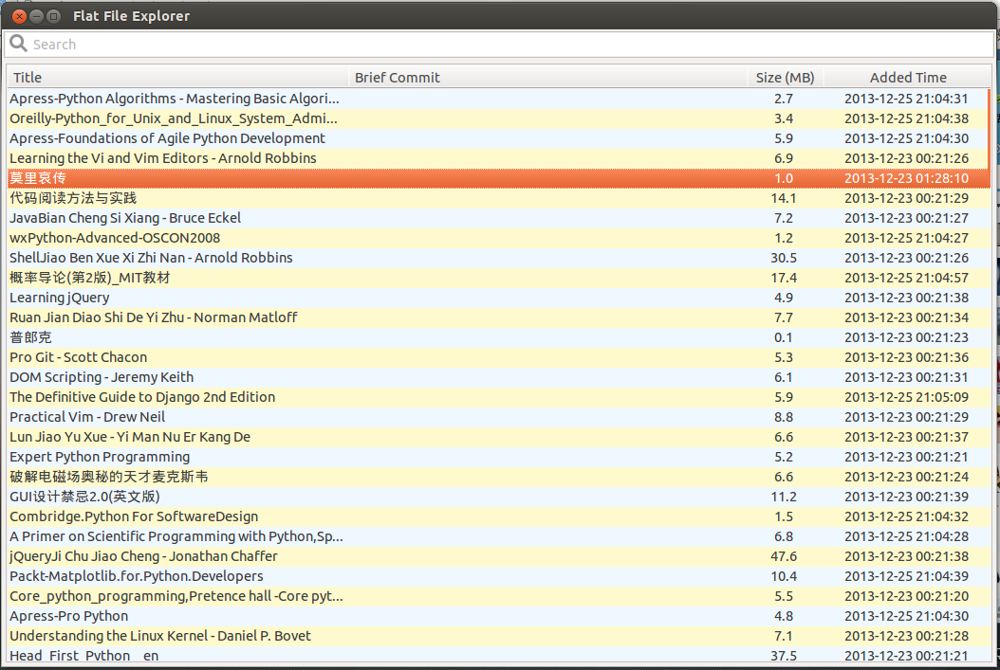

Flat File Explorer
==================

Flat file explorer for read-only files

Dev-env
-------

```
$ sudo pip install -r requirement.txt
$ git submodule init  # util module
$ git submodule update
```

Demo
----

`$ ./run.sh`

1. auto add `.pdf` file when startup
2. `F2` to rename file title
3. `Del`  key to delete file
4. double click to open corresponding file
5. searh




More Feature
------------

1. add file with specific extensions.
2. add files under specific path, ignore path under ingore list
3. `F2` to rename display filename
4. double click to open corresponding file
